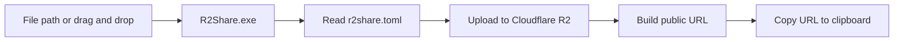

<h1 align="center">R2Share</h1>

<p align="center">
  Drag a file onto a small Windows executable. R2Share uploads it to Cloudflare R2, prints the public URL, and copies that URL to your clipboard.
</p>

<p align="center">
  <a href="README.md">English</a> | <a href="README.ja.md">日本語</a>
</p>

<p align="center">
  
  
  
  
</p>

> [!NOTE]
> This repository, including all code and documentation, was created with OpenCode.

R2Share is built for the small but annoying moment where you need a shareable link to a local file right now. No dashboard, no upload form, no extra UI. Drop the file on `R2Share.exe`, wait for the upload to finish, then paste the URL wherever you need it.

## What it does

| Feature | Behavior |
| --- | --- |
| Uploads files | Sends one or more local files to a Cloudflare R2 bucket. |
| Generates public URLs | Builds URLs from `public_base_url` and the stored object key. |
| Copies to clipboard | Copies successful URLs after the upload finishes. |
| Handles batches | Uploads multiple files one by one and reports failures separately. |
| Sets file metadata | Detects `Content-Type`, chooses `Content-Disposition`, and sets long cache headers. |
| Keeps names unique | Stores files under a date path with a ULID file name. |
| Stays open on Windows | Waits for Enter before closing, so drag and drop runs are readable. |

## Flow



## Requirements

| Requirement | Notes |
| --- | --- |
| Windows 11 | The tool is mainly designed for drag and drop use on Windows. |
| Rust | Needed when building from source. |
| Cloudflare R2 | You need a bucket, access keys, and an S3-compatible endpoint. |
| Public bucket or domain | R2Share assumes the uploaded object can be reached through `public_base_url`. |

## Configuration

Copy `r2share.toml.example` to `r2share.toml` and fill in your R2 values.

```toml
bucket = "discord-files"
endpoint = "https://<account_id>.r2.cloudflarestorage.com"
access_key_id = "<access_key_id>"
secret_access_key = "<secret_access_key>"
public_base_url = "https://files.example.com"
default_prefix = "uploads"
```

R2Share checks for config in this order:

1. `r2share.toml` next to `R2Share.exe`
2. `%APPDATA%\R2Share\config.toml`

For a released exe, putting `r2share.toml` in the same folder as `R2Share.exe` is the least fussy option. During development, `%APPDATA%\R2Share\config.toml` is often easier because `cargo run` uses a build output directory.

## Build

```powershell
cargo build --release
```

The executable is written to:

```text
target\release\R2Share.exe
```

## Use

Upload one file:

```powershell
R2Share.exe C:\path\to\video.mp4
```

Upload several files:

```powershell
R2Share.exe C:\path\to\image.png C:\path\to\archive.zip
```

Or just drag files onto `R2Share.exe` in Explorer. Windows passes those file paths as arguments, so the same upload path is used either way.

When every upload succeeds, the generated URLs are copied to the clipboard as newline-separated text. If some files fail, R2Share still prints the successful URLs and lists the failed files.

## Object keys and URLs

Uploaded files are stored with this object key shape:

```text
uploads/YYYY/MM/DD/<ULID>.<ext>
```

Example:

```text
uploads/2026/05/03/01KQQ13CPYWS6AYYVVCRZ0N2CK.mp4
```

The public URL is `public_base_url` plus the object key:

```text
https://files.example.com/uploads/2026/05/03/01KQQ13CPYWS6AYYVVCRZ0N2CK.mp4
```

## Upload headers

| Header | Value |
| --- | --- |
| `Content-Type` | Detected from the extension, or `application/octet-stream` when unknown. |
| `Content-Disposition` | `inline` for images, video, audio, text, JSON, XML, and PDF. Everything else uses `attachment`. |
| `Cache-Control` | `public, max-age=31536000` |

## Development

```powershell
cargo fmt
cargo test
cargo run -- C:\path\to\file.mp4
```

## Safety notes

R2Share is meant for public files. Anyone with the generated URL can open the uploaded object, so do not use it for secrets, private documents, or anything that should require authentication.

The real config file contains `secret_access_key`; keep `r2share.toml` out of Git. This repository already ignores it.

## Status

| Done | Not yet |
| --- | --- |
| Read `r2share.toml` | Windows notifications |
| Upload one or more files | Upload history |
| Generate ULID-based object keys | Delete uploaded URLs |
| Set content headers | CLI prefix override |
| Print and copy public URLs | GUI |
